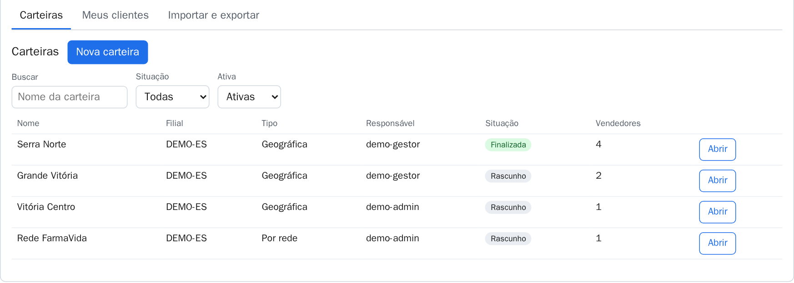
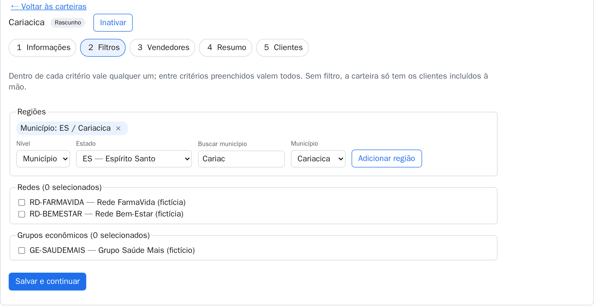
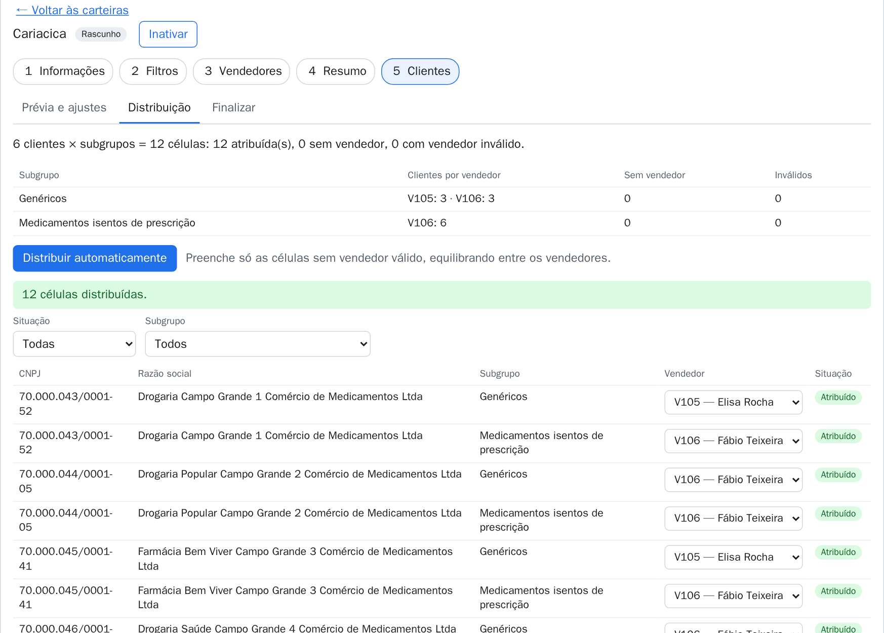
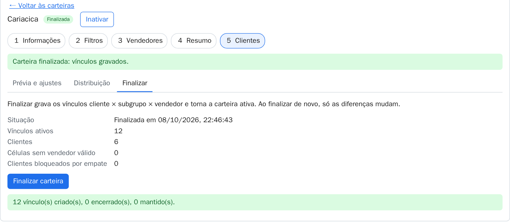
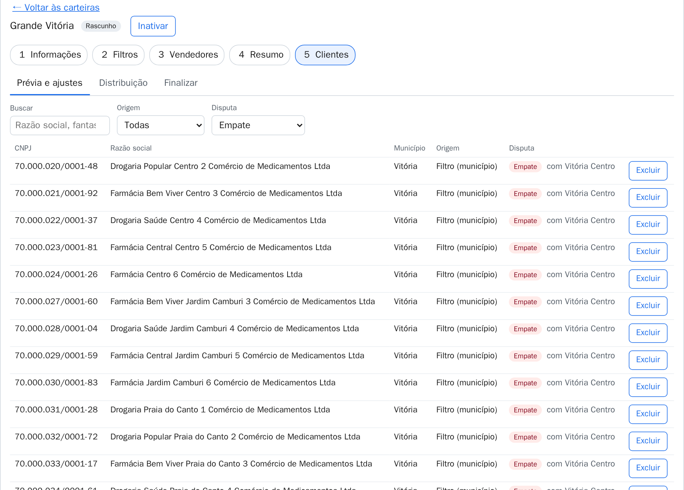
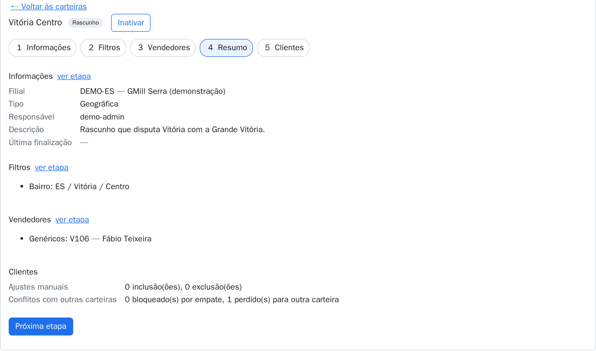
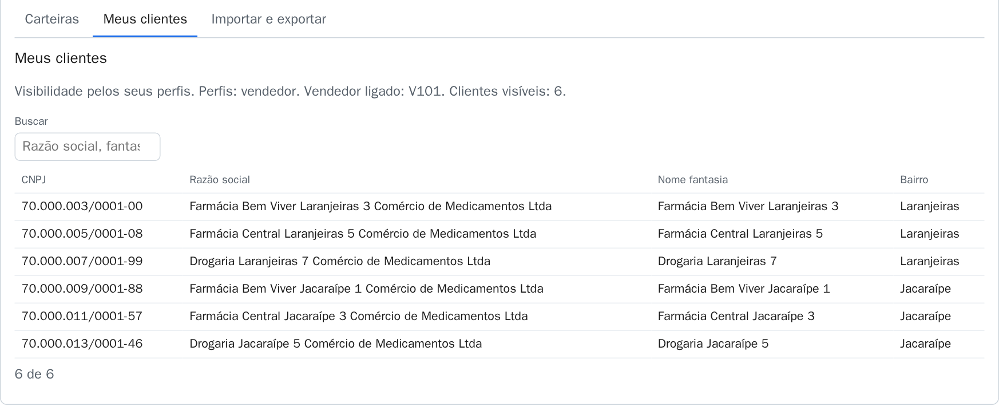
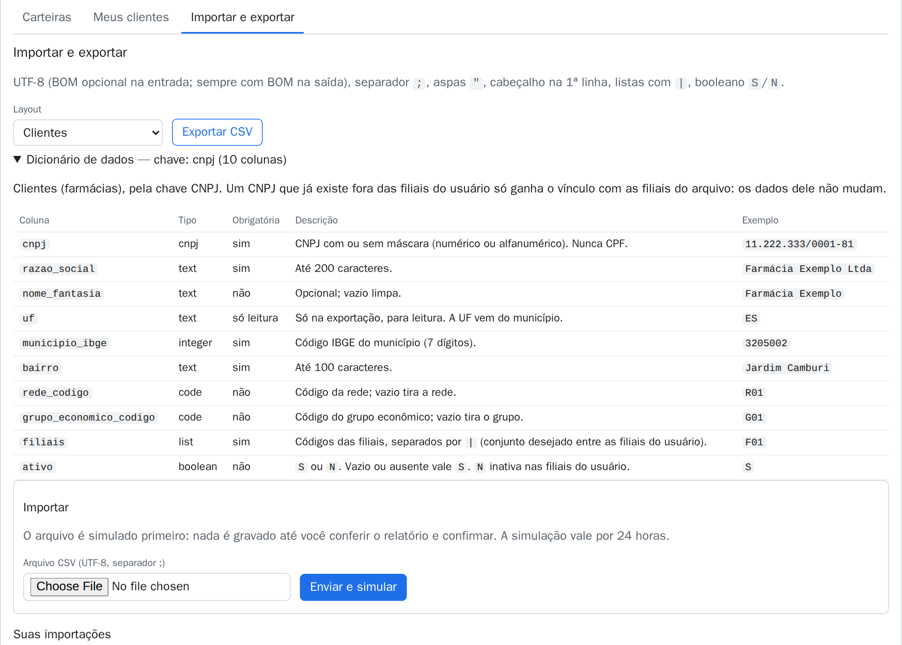

# Manual da Carteira de Clientes

A **Carteira de Clientes** do MeuGmill Vendas organiza quem atende cada farmácia, filial por filial. Uma
carteira junta os clientes de uma região, de uma rede ou de um grupo econômico e os divide entre os vendedores de
cada subgrupo de produto. Quando a carteira é finalizada, essa divisão vira vínculo: cada vendedor passa a ver só
os clientes dele, e o sistema principal usa a mesma regra para pedidos e títulos.

> As telas deste manual são da filial de demonstração **DEMO-ES**, com farmácias e vendedores fictícios.

## Perfis

Cada login traz um ou mais perfis e as filiais em que a pessoa atua. A tela mostra só o que o perfil pode fazer.

| Perfil     | O que vê                            | O que faz                                          |
| ---------- | ----------------------------------- | -------------------------------------------------- |
| admin      | Tudo das suas filiais               | Cria e edita carteiras, importa planilhas          |
| gestor     | As carteiras em que é o responsável | Edita as carteiras dele (filtros, vendedores etc.) |
| vendedor   | Só os clientes ligados a ele        | Consulta                                           |
| supervisão | Tudo das suas filiais               | Só consulta                                        |

O responsável de uma carteira (qualquer perfil) também pode editá-la. Trocar a filial ou o responsável, inativar e
reativar são só do admin da filial.

## Carteiras

A aba **Carteiras** lista as carteiras das suas filiais, com busca por nome e filtros de situação e de ativa ou
inativa. **Nova carteira** (só admin) abre o wizard vazio; **Abrir** abre uma carteira existente.



- **Rascunho**: a carteira ainda não gravou vínculos.
- **Finalizada**: os vínculos estão gravados. Editar de novo e finalizar grava só as diferenças.
- **Inativa**: só leitura; os vínculos dela foram encerrados.

## O wizard de 5 etapas

Toda carteira passa por cinco etapas. As etapas 1 a 3 gravam ao clicar em **Salvar e continuar**; a 4 só mostra;
a 5 trata dos clientes. Dá para pular de etapa pela barra numerada; se houver alteração não salva, a tela pergunta
antes de sair.

### 1. Informações

Nome (único na filial), descrição, filial, tipo de carteira e responsável. O responsável é o identificador do login
da pessoa.

### 2. Filtros

Quem entra na carteira pelos filtros:

- **Regiões**: estado, município ou bairro (bairro sempre dentro de um município).
- **Redes** e **grupos econômicos**.

Dentro de um critério vale **qualquer um** (este bairro ou aquele); entre critérios preenchidos valem **todos**
(região **e** rede). Uma carteira sem filtro só tem os clientes incluídos à mão.



### 3. Vendedores

Pares **subgrupo × vendedor**. Um subgrupo pode ter vários vendedores (a distribuição divide os clientes entre eles)
e um vendedor pode atender vários subgrupos. Só aparecem vendedores ativos na filial da carteira.

### 4. Resumo

Tudo o que a carteira é, numa página: informações, filtros, vendedores, ajustes manuais e conflitos com outras
carteiras.

### 5. Clientes

Três painéis:

- **Prévia e ajustes**: os clientes que a carteira alcança hoje, com a origem (filtro ou inclusão à mão) e a
  disputa com outras carteiras. **Excluir** tira um cliente que casa os filtros; **Incluir cliente à mão** põe um
  que não casa.
- **Distribuição**: a grade cliente × subgrupo. **Distribuir automaticamente** preenche só as células sem vendedor,
  equilibrando entre os vendedores; cada célula também pode ser trocada à mão.
- **Finalizar**: grava os vínculos e torna a carteira finalizada. Só funciona sem empates e com todas as células
  com vendedor.





## Disputa entre carteiras

Quando duas carteiras da mesma filial alcançam o mesmo cliente, vence a regra **mais específica**:

1. Inclusão à mão
2. Grupo econômico
3. Rede
4. Bairro
5. Município
6. Estado

Na prévia, cada cliente aparece como **Nesta carteira**, **Em outra carteira** (perdeu para uma regra mais
específica) ou **Empate** (duas carteiras com a mesma regra). O empate trava o cliente nas duas carteiras até alguém
decidir, e nenhuma delas finaliza enquanto houver empate.



**Como resolver:** refine a regra de uma das carteiras (por exemplo, trocar o município pelo bairro) ou use os
ajustes à mão. Não é preciso editar cliente por cliente.



## Inativar e reativar

No cabeçalho da carteira (só admin da filial). **Inativar** pede confirmação: encerra todos os vínculos da carteira
e a volta para rascunho. **Reativar** devolve a carteira como rascunho; é preciso finalizar de novo para gravar os
vínculos.

## Meus clientes

A aba **Meus clientes** mostra os clientes que o seu login enxerga e por quê (perfis, vendedor ligado ao login).
O vendedor vê só os clientes com vínculo ativo com ele.



## Planilhas: importar e exportar

A aba **Importar e exportar** cuida da carga inicial e da manutenção em lote.

1. Escolha o **layout** (filiais, subgrupos, redes, grupos, vendedores, clientes, carteiras ou vínculos) e abra o
   **dicionário de dados**: colunas, tipo, obrigatoriedade e exemplo.
2. **Exportar CSV** baixa os dados atuais no mesmo layout, prontos para ajustar.
3. **Enviar e simular** (só admin): o sistema simula o arquivo inteiro numa cópia do banco e mostra o resultado
   linha a linha, sem gravar nada.
4. Sem erros, **Confirmar e gravar** grava exatamente o que foi simulado. A simulação vale por 24 horas.



Formato: UTF-8, separador `;`, cabeçalho na primeira linha, listas dentro de um campo separadas por `|`,
booleano `S`/`N`, até 16 MB e 100 mil linhas. Reenviar um arquivo exportado sem mudanças dá tudo "sem mudança".
O arquivo nunca fica gravado no banco.

## Mensagens comuns

| Mensagem                                         | O que fazer                                                     |
| ------------------------------------------------ | --------------------------------------------------------------- |
| Outra pessoa alterou esta carteira               | A versão atual foi carregada: revise e repita                   |
| Não dá para finalizar: N célula(s) sem vendedor  | Distribua no painel Distribuição                                |
| Não dá para finalizar: N cliente(s) bloqueado(s) | Resolva os empates (refinar filtros ou ajustes)                 |
| A carteira está inativa                          | Reative para editar                                             |
| Sessão expirada                                  | O sistema principal renova o login; a tela continua onde estava |

## Para quem integra

- O componente entra no sistema principal com um script e uma tag:

  ```html
  <script type="module" src="https://<servidor>/gmill-carteira.js"></script>
  <gmill-carteira api-base="https://<servidor-da-api>"></gmill-carteira>
  <script>
    document.querySelector('gmill-carteira').token = tokenDoUsuario; // por propriedade, nunca atributo
  </script>
  ```

  Quando o token vence, o componente emite o evento `token-expired` para o sistema renovar.

- A API completa, com teste das chamadas, está na [Referência da API](./api.html).
